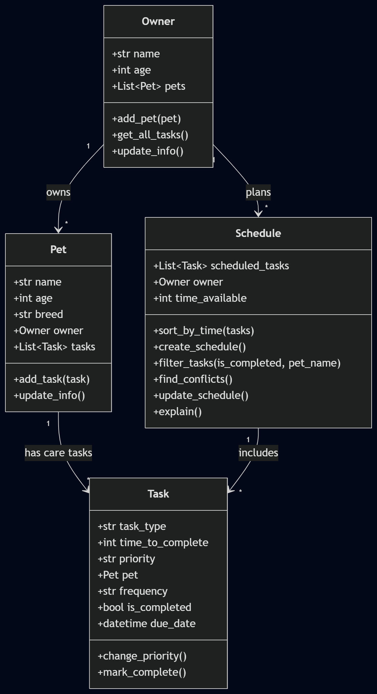

# PawPal+ (Module 2 Project)

You are building **PawPal+**, a Streamlit app that helps a pet owner plan care tasks for their pet.

## Scenario

A busy pet owner needs help staying consistent with pet care. They want an assistant that can:

- Track pet care tasks (walks, feeding, meds, enrichment, grooming, etc.)
- Consider constraints (time available, priority, owner preferences)
- Produce a daily plan and explain why it chose that plan

Your job is to design the system first (UML), then implement the logic in Python, then connect it to the Streamlit UI.

## What you will build

Your final app should:

- Let a user enter basic owner + pet info
- Let a user add/edit tasks (duration + priority at minimum)
- Generate a daily schedule/plan based on constraints and priorities
- Display the plan clearly (and ideally explain the reasoning)
- Include tests for the most important scheduling behaviors

## Features

- **Task sorting** — `Schedule.sort_by_time()` orders tasks from shortest to longest, so quick tasks get scheduled first.
- **Task filtering** — `Schedule.filter_tasks()` filters tasks by completion status, by pet name, or both at once.
- **Conflict warnings** — `Schedule.find_conflicts()` scans all tasks and flags any two tasks scheduled for the exact same date and time.
- **Daily & weekly recurring tasks** — `Task.mark_complete()` automatically creates the next occurrence of a task (one day later for daily tasks, one week later for weekly tasks) when it's marked done.
- **Schedule generation** — `Schedule.create_schedule()` builds a day's schedule by sorting pending tasks by time and fitting as many as possible into the owner's available time.

## Getting started

### Setup

```bash
python -m venv .venv
source .venv/bin/activate  # Windows: .venv\Scripts\activate
pip install -r requirements.txt
```

### Suggested workflow

1. Read the scenario carefully and identify requirements and edge cases.
2. Draft a UML diagram (classes, attributes, methods, relationships).
3. Convert UML into Python class stubs (no logic yet).
4. Implement scheduling logic in small increments.
5. Add tests to verify key behaviors.
6. Connect your logic to the Streamlit UI in `app.py`.
7. Refine UML so it matches what you actually built.

## 🖥️ Sample Output

Running `python main.py` prints a formatted table for each section (see [🖨️ Output Formatting](#-output-formatting) below for a full example).

## 🧪 Testing PawPal+

```bash
# Run the full test suite:
python -m pytest
```

These tests verify that task sorting, recurring task creation, and scheduling conflict detection work correctly.

Sample test output:

```text
collected 5 items

tests/test_pawpal.py .....                                            [100%]

5 passed in 0.05s
```

**Confidence Level:** 5/5

Reason: All five automated tests passed successfully. They covered the core scheduling features including sorting, recurring tasks, and conflict detection.

## 📐 Smarter Scheduling

> Fill in once you've implemented scheduling logic.

| Feature           | Method(s)                 | Notes                                                                     |
| ----------------- | ------------------------- | ------------------------------------------------------------------------- |
| Task sorting      | Schedule.sort_by_time()     | Sorts tasks by time_to_complete (shortest to longest).                                                  |
| Priority sorting  | Schedule.sort_by_priority() | Sorts tasks high → medium → low priority; ties are broken by shorter time_to_complete. Used by `create_schedule()`. |
| Filtering         | Schedule.filter_tasks()     | Filters tasks by pet name or completion status.                                                         |
| Conflict handling | Schedule.find_conflicts()   | Detects tasks scheduled at the same time and returns warning messages.                                  |
| Recurring tasks   | Task.mark_complete()        | Creates the next daily or weekly task when a recurring task is completed.                               |

## 🥇 Priority Scheduling

`Schedule.create_schedule()` now sorts pending tasks by **priority first** (high, then medium, then low), and uses `time_to_complete` as a tiebreaker within the same priority. This means important tasks get scheduled ahead of less important ones, even if a lower-priority task would take less time.

Sample output from `main.py`, showing a high-priority "Morning walk" (30 min) scheduled before a medium-priority "Litter box cleaning" (15 min):

```text
Today's Schedule
-----------------
Biscuit: Feeding (high priority, 10 min)
Biscuit: Morning walk (high priority, 30 min)
Mochi: Litter box cleaning (medium priority, 15 min)

All Tasks Sorted by Priority (then Time)
------------------------------------------
Biscuit: Feeding (high priority, 10 min)
Biscuit: Morning walk (high priority, 30 min)
Biscuit: Vet checkup (high priority, 30 min)
Mochi: Litter box cleaning (medium priority, 15 min)
Mochi: Litter box cleaning (medium priority, 15 min)
Mochi: Grooming (medium priority, 30 min)
Mochi: Playtime (low priority, 20 min)
```

## 🖨️ Output Formatting

Both the CLI (`main.py`) and the Streamlit UI (`app.py`) present tasks with structured tables and status indicators instead of plain text lines.

- **CLI tables** — `main.py` uses the [`tabulate`](https://pypi.org/project/tabulate/) library (added to `requirements.txt`) to render each section (schedule, sorted tasks, completed tasks, per-pet tasks) as a grid table via `tabulate(rows, headers="keys", tablefmt="grid")`.
- **Status indicators** — a small `priority_label()` helper maps `"high"/"medium"/"low"` to 🔴/🟡/🟢, and a `status_label()` helper maps `is_completed` to ✅ Done / ⏳ Pending. Both are defined once in `main.py` and mirrored in `app.py` for consistency.
- **Conflict warnings** — printed with a ⚠️ prefix in the CLI, and shown with `st.warning()` in the UI; a clean schedule shows a ✅ success message in both places.
- **Streamlit UI** — task and schedule tables use `st.table()` with the same priority/status emoji labels, section headers use emoji + `st.subheader()`/`st.markdown()`, and confirmations (adding a pet/task, generating a schedule, no conflicts) use `st.success()`.

Sample CLI output from `python main.py`:

```text
==================================================
🐾  PawPal+ Daily Schedule
==================================================

📅 Today's Schedule
------------------
+---------+---------------------+------------+--------------+
| Pet     | Task                | Priority   |   Time (min) |
+=========+=====================+============+==============+
| Biscuit | Feeding             | 🔴 High     |           10 |
+---------+---------------------+------------+--------------+
| Biscuit | Morning walk        | 🔴 High     |           30 |
+---------+---------------------+------------+--------------+
| Mochi   | Litter box cleaning | 🟡 Medium   |           15 |
+---------+---------------------+------------+--------------+

✅ Completed Tasks
-----------------
+-------+---------------------+----------+
| Pet   | Task                | Status   |
+=======+=====================+==========+
| Mochi | Litter box cleaning | ✅ Done   |
+-------+---------------------+----------+

⚠️  Scheduling Conflicts
------------------------
⚠️  Warning: Biscuit's 'Vet checkup' and Mochi's 'Grooming' are both scheduled at 2026-07-08 08:00.
```

> **Note:** on Windows, the console defaults to an encoding that can't print emoji, so `main.py` calls `sys.stdout.reconfigure(encoding="utf-8")` at startup to fix this.

## 💾 Data Persistence

PawPal+ saves pets and tasks to a local `data.json` file so your data survives between runs.

- `Owner.save_to_json()` converts the owner, their pets, and all tasks into plain dictionaries and writes them to `data.json` using Python's built-in `json` module.
- `Owner.load_from_json()` reads `data.json` back and reconstructs the `Owner`, `Pet`, and `Task` objects.
- **`app.py`** loads `data.json` automatically when the app starts (falling back to a fresh owner if the file doesn't exist yet), and saves automatically whenever a pet or task is added.
- **`main.py`** demonstrates saving the sample data to `data.json` and reloading it.
- `data.json` is generated at runtime and is excluded from version control via `.gitignore`.

**Files modified for this feature:** `pawpal_system.py`, `app.py`, `main.py`, `.gitignore`, `README.md`.

## 📸 Demo Walkthrough

### What you can do in the app

The Streamlit app (`app.py`) lets you:

- Enter an owner name and add one or more pets (name, breed, species).
- Add care tasks to a selected pet (title, duration in minutes, priority).
- Set the total time available for the day and generate a schedule.
- See the generated schedule, tasks sorted by time, pending tasks, and any scheduling conflicts.

### Example workflow

1. **Add a pet** — enter a pet name and breed, then click "Add pet." The pet appears in the "Current pets" table.
2. **Add tasks** — select the pet, enter a task title, duration, and priority, then click "Add task." Repeat for as many tasks as you like, across one or more pets.
3. **Set time available** — enter how many minutes you have for the day.
4. **Generate today's schedule** — click "Generate schedule" to see which tasks fit in the available time, sorted shortest-first.

### Scheduler behaviors demonstrated

- **Sorting** — the "Tasks Sorted by Time" table always lists tasks shortest-to-longest, so quick wins are scheduled first.
- **Filtering** — the "Pending Tasks" table filters out anything already marked complete.
- **Conflict warnings** — if two tasks share the exact same due date/time, a warning is shown for each conflicting pair; otherwise a success message confirms there are no conflicts.
- **Recurring tasks** — completing a daily or weekly task automatically creates its next occurrence (one day or one week later), so the schedule stays populated over time.

### Sample CLI output (`main.py`)

`main.py` builds a small sample owner/pet/task setup (including one completed recurring task and two tasks scheduled at the same time) and prints the results directly to the console:

```bash
python main.py
```

```text
Today's Schedule
-----------------
Biscuit: Feeding (high priority, 10 min)
Mochi: Litter box cleaning (medium priority, 15 min)
Mochi: Playtime (low priority, 20 min)

All Tasks Sorted by Time
-------------------------
Biscuit: Feeding (10 min)
Mochi: Litter box cleaning (15 min)
Mochi: Litter box cleaning (15 min)
Mochi: Playtime (20 min)
Biscuit: Morning walk (30 min)
Biscuit: Vet checkup (30 min)
Mochi: Grooming (30 min)

Completed Tasks
----------------
Mochi: Litter box cleaning

Mochi's Tasks
--------------
Playtime (pending, due 2026-07-07)
Litter box cleaning (done, due 2026-07-07)
Grooming (pending, due 2026-07-08)
Litter box cleaning (pending, due 2026-07-08)

Scheduling Conflicts
---------------------
Warning: Biscuit's 'Vet checkup' and Mochi's 'Grooming' are both scheduled at 2026-07-08 08:00.
```

Note the second "Litter box cleaning" entry — that's the new task automatically created after the original one was marked complete, due the next day.

**Screenshot or video** _(optional)_: <!-- Insert a screenshot or link to a demo video here -->

## 📊 Final UML Diagram


